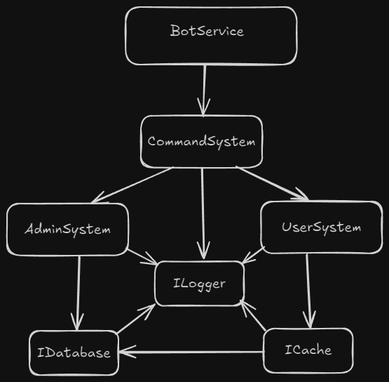

# Using Services

:::info[What's a service?]

A component in your program - usually a class - that another component depends on for something,
instead of doing it itself.

:::

Bots get the most value from Hades when they adopt a **service oriented architecture** where we keep
the various parts of our programs small, doing just one thing. Instead of big components that do a
lot, we'll prefer small components that rely on each other.

Hades excels at wiring your components automatically. This lets you focus on writing small easy to
understand components while Hades fits them together for you.

<center>
    
    <figcaption>
        Learn more about [service oriented architecture](/docs/guides/solid-code)
        and [dependency injection](/docs/guides/di).
    </figcaption>
</center>

## Baby's First Service

Consider the minimal example bot:

```ts
export class BotService extends HadesBotService {
  async onReady() {
    console.log(`Logged in as ${this.client.user.username}.`);
  }
}
```

This bot is claiming for itself the responsibility for how we do logging. In this case,
`console.log` is the logging approach taken.

- But what if we wanted to change how logging works?

- *Well we just change the line!*

- Sure, but if we have a lot of logging throughout a large project?

- **RIP.**

Instead, when we need to log, we should delegate to some service specialized just for that purpose.

### Delegating to a Service

Let's define a `ConsoleLogger` that will capture our current logging approach:

```ts
class ConsoleLogger {
    log(msg: string) { console.log(msg) }
    warn(msg: string) { console.warn(msg) }
    error(msg: string) { console.error(msg) }
}
```

Now we can delegate logging to the service:

```ts
export class BotService extends HadesBotService {
  logger = new ConsoleLogger()

  async onReady() {
    this.logger.log(`Logged in as ${this.client.user.username}.`);
  }
}
```

`BotService` is still too picky about logging, however, deciding for itself to always use
`console.log`.

### Delegating to an Interface

To get `BotService` fully out of the business of making decisions about logging it should instead
delegate to an interface. Because real interfaces disappear at runtime (TypeScript is type-erased),
we'll instead use abstract classes:

```ts
export abstract class ILogger {
    abstract log(msg: string): void
    abstract warn(msg: string): void
    abstract error(msg: string): void
}
```

Now the bot can declare and use an `ILogger`:

```ts
export class BotService extends HadesBotService {
  @inject(ILogger)
  logger: ILogger

  async onReady() {
    this.logger.log(`Logged in as ${this.client.user.username}.`);
  }
}
```

But where does the actual logger come from? Hades! The `@inject(ILogger)` decorator tells Hades
where an `ILogger` is expected. When `BotService` is created, Hades will ensure that it receives
one.

### Binding Interfaces to Services

Hades knows that it needs to provide services for all `@inject` decorated fields. But when it sees
that it needs to provide an `ILogger`, it doesn't automatically know which class should be used.

So we need to tell Hades:

- *Anyone who needs an `ILogger` should get a `ConsoleLogger`.*

There are a few ways to to do that. For now we'll pass an arrow function to `boot`:

```ts
boot(BotService, [
    (container) => {
        container
            .bind(ILogger)
            .to(ConsoleLogger)
            .inSingletonScope()
    }
])
```

:::info
`inSingletonScope()` ensures that everyone shares the same `ConsoleLogger` instance.
:::

Again, this tells Hades that anytime someone requests an `ILogger`, they should be given a
`ConsoleLogger`. We can now control how logging works for everyone in a single place.


### Fancy Binding Logic

Now that we know how to delegate to interfaces and tell Hades which services should be bound to
which interfaces we can get a bit more sophisticated.

Let's define another `ILogger`:

```ts
export class NullLogger extends ILogger {
    log(msg: string) { return; }
    warn(msg: string) { return; }
    error(msg: string) { return; }
}
```

This logger doesn't do anything. But there could be cases where we want to disable logging entirely.
Now that's trivial with a bit of logic in our binding function:

```ts
boot(BotService, [
    (container) => {
        container
            .bind(ILogger)
            .to(process.env.DEBUG ? ConsoleLogger : NullLogger)
            .inSingletonScope()
    }
])
```

With this change, logging will only be enabled when the `DEBUG` environment variable is present. A
service oriented architecture removes this kind of decision making from your components, making them
leaner - therefore clearer. Maybe in production, instead of no logging, you log to some third-party
provider, etc.

Hopefully you can start to see the hygiene of this approach. If you are working on your project
because you think it could grow into something worthwhile, Hades could be what helps your project
withstand that growth.
