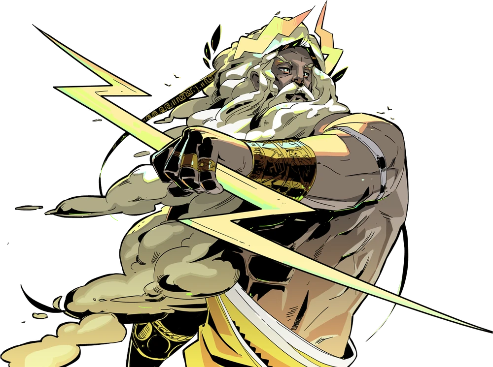

# Zeus (Rules and Roles)

This is bot built with [Hades](https://github.com/hades-ts/hades), the Discord bot framework.

  

<pre style="text-align: center;">
    With Zeus, users can reference the server's rules and get roles.
    Visit https://hades-ts.github.io/docs/bots/zeus to get started.
</pre>
